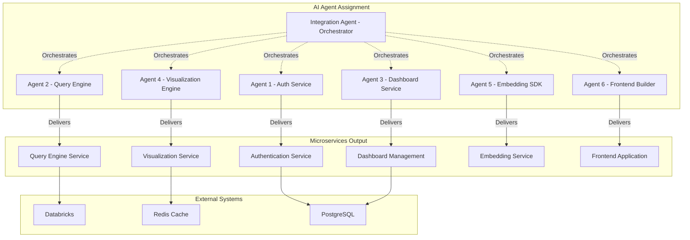
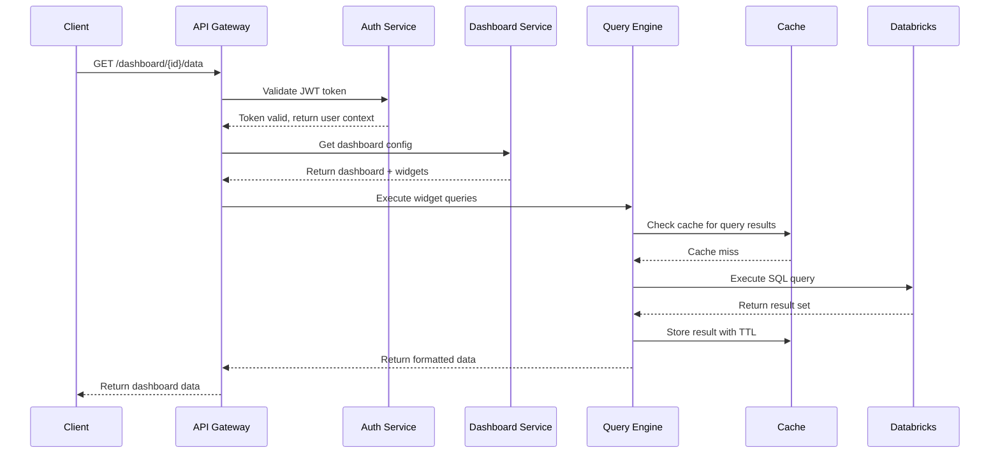
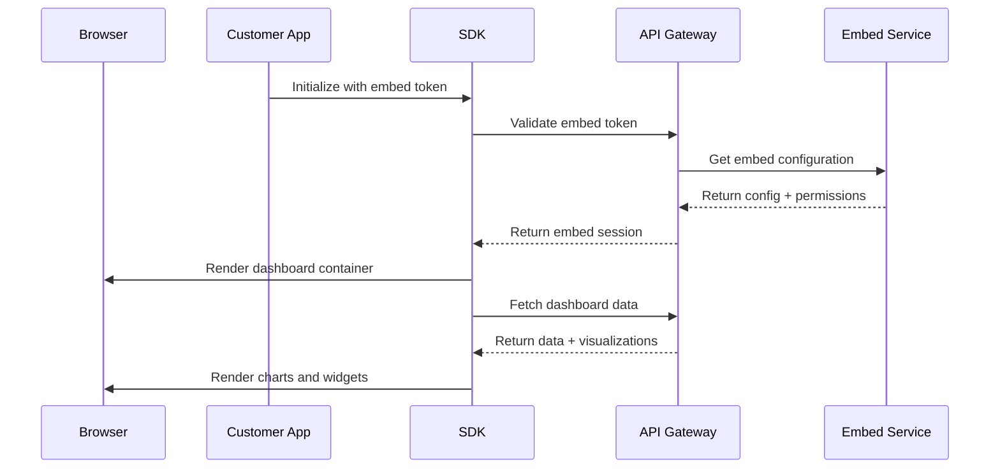
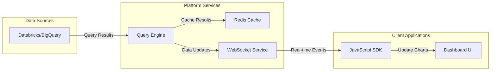
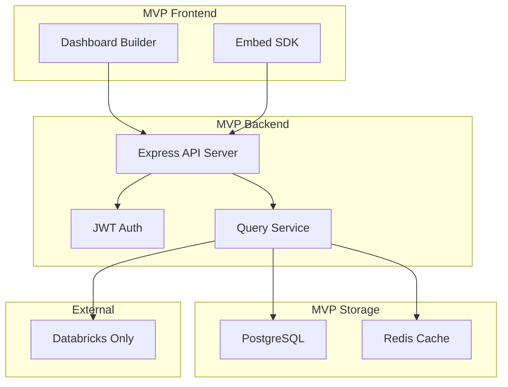

# Technical Architecture Document
## Embedded Analytics Dashboard Platform - AI Agent Development

**Version:** 2.0  
**Date:** July 26, 2025  
**Development Model:** Parallel AI Agent Microservices  
**Lead Integration Agent:** [To be assigned]  
**Classification:** AI-Driven Development Specification  

---

## Table of Contents
1. [AI Agent Development Model](#1-ai-agent-development-model)
2. [Microservices Architecture](#2-microservices-architecture)
3. [Agent Responsibilities & Deliverables](#3-agent-responsibilities--deliverables)
4. [Integration Strategy](#4-integration-strategy)
5. [TypeScript-First Development](#5-typescript-first-development)
6. [Parallel Development Timeline](#6-parallel-development-timeline)
7. [Inter-Service Communication](#7-inter-service-communication)
8. [Testing & Quality Assurance](#8-testing--quality-assurance)
9. [Deployment & DevOps](#9-deployment--devops)
10. [Integration Agent Guidelines](#10-integration-agent-guidelines)

---

## 1. AI Agent Development Model

### 1.1 Development Philosophy

This project leverages **AI Agent Parallel Development** where each microservice is developed independently by specialized AI agents, with a central **Integration Agent** responsible for orchestration, API contracts, and final system integration.

**Key Principles:**
- **TypeScript-First:** All code written in TypeScript for type safety and better AI code generation
- **Contract-Driven:** APIs defined first, services developed in parallel
- **Autonomous Agents:** Each agent owns complete microservice lifecycle
- **Integration-Focused:** Central agent ensures cohesive system architecture

### 1.2 Agent-Driven Microservices Architecture



### 1.3 TypeScript-Only Technology Stack

#### Core Technologies (All TypeScript)
- **Runtime:** Node.js 20+ with TypeScript 5.0+
- **Framework:** Fastify (high performance, TypeScript-native)
- **Database ORM:** Prisma (type-safe database client)
- **Validation:** Zod (TypeScript-first schema validation)
- **Authentication:** JWT with jose library
- **Caching:** ioredis (TypeScript Redis client)

#### Frontend Stack (TypeScript)
- **Framework:** React 18+ with TypeScript
- **Build Tool:** Vite (fast TypeScript compilation)
- **Visualization:** D3.js v7 + Recharts (both TypeScript-native)
- **State Management:** Zustand (TypeScript-first)
- **Styling:** Tailwind CSS + styled-components
- **SDK:** Pure TypeScript library with React bindings

#### DevOps & Infrastructure
- **Containerization:** Docker with multi-stage TypeScript builds
- **Orchestration:** Kubernetes with TypeScript operators
- **API Gateway:** Traefik (supports TypeScript configuration)
- **Monitoring:** Prometheus + Grafana
- **Testing:** Jest + Testing Library (TypeScript)

---

## 2. Microservices Architecture

### 2.1 Service Decomposition Strategy

Each microservice is designed for **autonomous development** by a dedicated AI agent, with clear boundaries and minimal inter-service dependencies during development phase.

#### Service Independence Matrix
| Service | Dependencies | Agent Autonomy | Development Order |
|---------|-------------|----------------|------------------|
| Authentication | None | 100% | 1st (Foundation) |
| Query Engine | Auth (JWT only) | 95% | 2nd (Core) |
| Dashboard Management | Auth + Query | 90% | 3rd (Business Logic) |
| Visualization Engine | None (data via API) | 100% | 2nd (Parallel) |
| Embedding SDK | Auth + Dashboard | 85% | 4th (Integration) |
| Frontend Builder | All services | 70% | 5th (Assembly) |

### 2.2 Microservice Specifications

#### Authentication Service (Agent 1)
**Port:** 3001 | **Database:** PostgreSQL | **Dependencies:** None

```typescript
// Service Interface
export interface AuthService {
  // Core authentication
  login(credentials: LoginRequest): Promise<AuthResponse>
  register(userData: RegisterRequest): Promise<User>
  validateToken(token: string): Promise<TokenPayload>
  refreshToken(refreshToken: string): Promise<AuthResponse>
  
  // Multi-tenant support
  createTenant(tenantData: CreateTenantRequest): Promise<Tenant>
  validateTenantAccess(userId: string, tenantId: string): Promise<boolean>
}

// Database Schema (Prisma)
model User {
  id        String   @id @default(cuid())
  email     String   @unique
  password  String
  createdAt DateTime @default(now())
  tenants   UserTenant[]
}

model Tenant {
  id        String   @id @default(cuid())
  name      String
  subdomain String   @unique
  users     UserTenant[]
}

model UserTenant {
  userId   String
  tenantId String
  role     Role
  user     User   @relation(fields: [userId], references: [id])
  tenant   Tenant @relation(fields: [tenantId], references: [id])
  @@id([userId, tenantId])
}
```

#### Query Engine Service (Agent 2)
**Port:** 3002 | **Database:** Redis Cache | **Dependencies:** Auth (JWT validation)

```typescript
// Service Interface
export interface QueryEngineService {
  // Connection management
  createConnection(config: DataSourceConfig): Promise<ConnectionResult>
  testConnection(connectionId: string): Promise<HealthStatus>
  
  // Query execution
  executeQuery(request: QueryRequest): Promise<QueryResult>
  getCachedResult(queryHash: string): Promise<QueryResult | null>
  
  // Schema introspection
  getSchema(connectionId: string): Promise<SchemaInfo[]>
}

// Databricks Connector (Primary)
class DatabricksConnector {
  async connect(config: DatabricksConfig): Promise<void>
  async executeSQL(query: string, params?: Record<string, any>): Promise<any[]>
  async getTableSchema(tableName: string): Promise<ColumnInfo[]>
}

// Query Request/Response Types
interface QueryRequest {
  tenantId: string        // From JWT token
  connectionId: string
  sql: string
  parameters?: Record<string, any>
  cacheKey?: string
  ttl?: number
}

interface QueryResult {
  data: any[]
  columns: ColumnDefinition[]
  executionTime: number
  totalRows: number
  cached: boolean
}
```

#### Dashboard Management Service (Agent 3)
**Port:** 3003 | **Database:** PostgreSQL | **Dependencies:** Auth + Query Engine

```typescript
// Service Interface
export interface DashboardService {
  // Dashboard CRUD
  createDashboard(dashboard: CreateDashboardRequest): Promise<Dashboard>
  updateDashboard(id: string, updates: UpdateDashboardRequest): Promise<Dashboard>
  deleteDashboard(id: string): Promise<void>
  getDashboard(id: string): Promise<Dashboard>
  listDashboards(tenantId: string, filters?: DashboardFilters): Promise<Dashboard[]>
  
  // Widget management
  addWidget(dashboardId: string, widget: CreateWidgetRequest): Promise<Widget>
  updateWidget(widgetId: string, updates: UpdateWidgetRequest): Promise<Widget>
  deleteWidget(widgetId: string): Promise<void>
}

// Prisma Schema
model Dashboard {
  id          String   @id @default(cuid())
  tenantId    String
  name        String
  description String?
  layout      Json     @default("{}")
  settings    Json     @default("{}")
  widgets     Widget[]
  createdAt   DateTime @default(now())
  updatedAt   DateTime @updatedAt
}

model Widget {
  id            String    @id @default(cuid())
  dashboardId   String
  type          WidgetType
  position      Json      // {x, y, width, height}
  query         Json      // SQL query + parameters
  visualization Json      // Chart configuration
  styling       Json      @default("{}")
  dashboard     Dashboard @relation(fields: [dashboardId], references: [id])
}

enum WidgetType {
  CHART
  TABLE
  METRIC
  FILTER
}
```

#### Visualization Engine Service (Agent 4)
**Port:** 3004 | **Database:** Redis (chart cache) | **Dependencies:** None

```typescript
// Service Interface
export interface VisualizationService {
  // Chart generation
  generateChart(config: ChartConfig, data: any[]): Promise<ChartOutput>
  renderChart(chartId: string): Promise<ChartElement>
  
  // Chart types
  createBarChart(config: BarChartConfig, data: any[]): Promise<ChartSVG>
  createLineChart(config: LineChartConfig, data: any[]): Promise<ChartSVG>
  createPieChart(config: PieChartConfig, data: any[]): Promise<ChartSVG>
  createDataTable(config: TableConfig, data: any[]): Promise<TableHTML>
}

// Chart Configuration Types
interface ChartConfig {
  type: 'bar' | 'line' | 'pie' | 'table' | 'metric'
  dimensions: string[]     // Column names for grouping
  measures: string[]       // Column names for values
  styling: ChartStyling
  interactions: ChartInteractions
}

interface ChartStyling {
  colors: string[]
  font: FontConfig
  theme: 'light' | 'dark' | 'custom'
  customCSS?: string
}

// Chart Renderers (D3.js + TypeScript)
class BarChartRenderer {
  render(data: any[], config: BarChartConfig): string // Returns SVG
}

class LineChartRenderer {
  render(data: any[], config: LineChartConfig): string // Returns SVG  
}
```

#### Embedding SDK Service (Agent 5)
**Port:** 3005 | **Database:** None | **Dependencies:** Auth + Dashboard

```typescript
// TypeScript SDK Library
export class EmbeddedDashboard {
  private config: EmbedConfig
  private apiClient: ApiClient
  private eventEmitter: EventTarget
  
  constructor(config: EmbedConfig) {
    this.config = config
    this.apiClient = new ApiClient(config.baseUrl, config.token)
  }
  
  // Core embedding methods
  async render(containerId: string): Promise<void> {
    const container = document.getElementById(containerId)
    if (!container) throw new Error(`Container ${containerId} not found`)
    
    const dashboardData = await this.fetchDashboardData()
    const charts = await this.renderCharts(dashboardData)
    
    container.innerHTML = this.buildDashboardHTML(charts)
    this.attachEventListeners()
  }
  
  // Event handling
  on(event: EmbedEvent, callback: EventCallback): void {
    this.eventEmitter.addEventListener(event, callback)
  }
  
  // Interaction methods
  async applyFilters(filters: FilterSet): Promise<void>
  async exportData(format: 'csv' | 'json' | 'xlsx'): Promise<Blob>
  async refreshData(): Promise<void>
}

// Usage Example
const dashboard = new EmbeddedDashboard({
  token: 'jwt_token_here',
  baseUrl: 'https://api.platform.com',
  dashboardId: 'dashboard_id',
  theme: 'light'
})

await dashboard.render('my-dashboard-container')
```

#### Frontend Builder Application (Agent 6)
**Port:** 3000 | **Framework:** React + TypeScript | **Dependencies:** All services

```typescript
// Main Dashboard Builder App
export const DashboardBuilder: React.FC = () => {
  const [dashboard, setDashboard] = useState<Dashboard | null>(null)
  const [widgets, setWidgets] = useState<Widget[]>([])
  const [dataSources, setDataSources] = useState<DataSource[]>([])
  
  return (
    <div className="dashboard-builder">
      <Sidebar dataSources={dataSources} />
      <DragDropCanvas 
        widgets={widgets}
        onWidgetAdd={handleWidgetAdd}
        onWidgetUpdate={handleWidgetUpdate}
      />
      <PropertiesPanel selectedWidget={selectedWidget} />
    </div>
  )
}

// Drag & Drop Canvas Component
interface DragDropCanvasProps {
  widgets: Widget[]
  onWidgetAdd: (widget: CreateWidgetRequest) => void
  onWidgetUpdate: (id: string, updates: Partial<Widget>) => void
}

export const DragDropCanvas: React.FC<DragDropCanvasProps> = ({
  widgets,
  onWidgetAdd,
  onWidgetUpdate
}) => {
  // Implement drag & drop using react-dnd
  // Grid layout using react-grid-layout
  // Real-time preview of charts
}
```

## 3. Agent Responsibilities & Deliverables

### 3.1 Agent Assignment & Deliverables

#### Integration Agent (Orchestrator)
**Primary Responsibility:** System architecture, API contracts, service integration

**Deliverables:**
- [ ] OpenAPI 3.0 specifications for all services
- [ ] Docker Compose orchestration file
- [ ] Kubernetes deployment manifests  
- [ ] CI/CD pipeline configuration
- [ ] Inter-service authentication setup
- [ ] API Gateway configuration (Traefik)
- [ ] Service mesh integration (optional)
- [ ] End-to-end integration tests
- [ ] Performance benchmarking suite
- [ ] Documentation and deployment guides

**Timeline:** 2 weeks (parallel with other agents)

#### Agent 1: Authentication Service
**Responsibility:** Multi-tenant JWT authentication and user management

**Deliverables:**
- [ ] TypeScript Fastify service with Prisma ORM
- [ ] JWT token generation and validation
- [ ] Multi-tenant user management
- [ ] Password hashing and security
- [ ] Database migrations and seeders
- [ ] Unit tests (95% coverage)
- [ ] API documentation
- [ ] Docker containerization
- [ ] Health check endpoints
- [ ] Rate limiting implementation

**Timeline:** 1.5 weeks
**Dependencies:** None (can start immediately)

#### Agent 2: Query Engine Service  
**Responsibility:** Databricks connection and SQL query execution

**Deliverables:**
- [ ] TypeScript Fastify service
- [ ] Databricks connector with connection pooling
- [ ] Redis caching layer
- [ ] SQL query validation and optimization
- [ ] Schema introspection endpoints
- [ ] Query result transformation
- [ ] Error handling and retries
- [ ] Unit and integration tests
- [ ] Performance monitoring
- [ ] Docker containerization

**Timeline:** 2 weeks
**Dependencies:** Agent 1 (JWT validation)

#### Agent 3: Dashboard Management Service
**Responsibility:** Dashboard and widget CRUD operations

**Deliverables:**
- [ ] TypeScript Fastify service with Prisma
- [ ] Dashboard CRUD operations
- [ ] Widget management system
- [ ] Layout management
- [ ] Dashboard sharing and permissions
- [ ] Data validation with Zod schemas
- [ ] Database migrations
- [ ] Unit tests (90% coverage)
- [ ] API documentation
- [ ] Docker containerization

**Timeline:** 1.5 weeks
**Dependencies:** Agent 1 (authentication)

#### Agent 4: Visualization Engine Service
**Responsibility:** Chart generation and rendering

**Deliverables:**
- [ ] TypeScript service for chart generation
- [ ] D3.js chart renderers (Bar, Line, Pie, Table)
- [ ] SVG/Canvas output generation
- [ ] Chart styling and theming
- [ ] Responsive chart layouts
- [ ] Chart caching system
- [ ] Export functionality (PNG, SVG, PDF)
- [ ] Unit tests for all chart types
- [ ] Performance optimization
- [ ] Docker containerization

**Timeline:** 2 weeks
**Dependencies:** None (uses data from API calls)

#### Agent 5: Embedding SDK Service
**Responsibility:** TypeScript SDK for dashboard embedding

**Deliverables:**
- [ ] Pure TypeScript SDK library
- [ ] React wrapper components
- [ ] Vue.js wrapper (optional)
- [ ] NPM package configuration
- [ ] SDK documentation and examples
- [ ] Authentication handling
- [ ] Event system for interactions
- [ ] Responsive embedding
- [ ] CDN distribution setup
- [ ] Integration testing

**Timeline:** 1.5 weeks
**Dependencies:** Agents 1, 3, 4 (API contracts)

#### Agent 6: Frontend Builder Application
**Responsibility:** React dashboard builder interface

**Deliverables:**
- [ ] React + TypeScript application
- [ ] Drag & drop dashboard builder
- [ ] Chart configuration UI
- [ ] Data source connection interface
- [ ] Real-time dashboard preview
- [ ] User authentication integration
- [ ] Responsive design (Tailwind CSS)
- [ ] State management (Zustand)
- [ ] End-to-end tests
- [ ] Production build optimization

**Timeline:** 2.5 weeks
**Dependencies:** All other agents (consumes all APIs)

### 3.2 Parallel Development Strategy

#### Week 1: Foundation Phase
**Parallel Execution:**
- Integration Agent: API specifications + infrastructure setup
- Agent 1: Authentication service development
- Agent 4: Visualization engine (independent)

#### Week 1.5: Core Services
**Parallel Execution:**
- Agent 2: Query engine (depends on Agent 1 JWT)
- Agent 3: Dashboard management (depends on Agent 1)
- Agent 4: Continues visualization work
- Agent 5: Begins SDK development

#### Week 2: Integration Phase
**Parallel Execution:**  
- Agent 6: Frontend development begins
- Integration Agent: Service integration testing
- All agents: Final testing and deployment prep

#### Week 2.5: Final Assembly
**Sequential Execution:**
- Integration Agent: End-to-end testing
- All agents: Bug fixes and optimization
- Integration Agent: Production deployment

## 4. Integration Strategy

### 4.1 API-First Development

All services must adhere to **OpenAPI 3.0 specifications** defined by the Integration Agent before development begins.

#### Service Communication Pattern
```typescript
// Standard service-to-service communication
interface ServiceClient {
  baseUrl: string
  timeout: number
  retries: number
  authentication: {
    type: 'jwt' | 'api-key'
    token: string
  }
}

// Example: Dashboard service calling Query Engine
class DashboardService {
  private queryEngineClient: ServiceClient
  
  async getWidgetData(widgetId: string): Promise<QueryResult> {
    const widget = await this.getWidget(widgetId)
    
    return this.queryEngineClient.post('/execute-query', {
      sql: widget.query.sql,
      parameters: widget.query.parameters,
      tenantId: this.tenantId
    })
  }
}
```

### 4.2 Shared TypeScript Definitions

The Integration Agent maintains a **shared types library** that all services import:

```typescript
// @platform/shared-types package
export interface User {
  id: string
  email: string
  tenantId: string
  role: UserRole
}

export interface Dashboard {
  id: string
  tenantId: string
  name: string
  widgets: Widget[]
  layout: DashboardLayout
}

export interface QueryResult {
  data: any[]
  columns: ColumnDefinition[]
  executionTime: number
  cached: boolean
}

// Each service imports these types
import { User, Dashboard, QueryResult } from '@platform/shared-types'
```

### 4.3 Service Discovery & Configuration

```typescript
// services.config.ts (managed by Integration Agent)
export const ServiceConfig = {
  auth: {
    url: process.env.AUTH_SERVICE_URL || 'http://auth-service:3001',
    timeout: 5000
  },
  queryEngine: {
    url: process.env.QUERY_ENGINE_URL || 'http://query-engine:3002',
    timeout: 30000
  },
  dashboard: {
    url: process.env.DASHBOARD_SERVICE_URL || 'http://dashboard-service:3003',
    timeout: 10000
  },
  visualization: {
    url: process.env.VIZ_SERVICE_URL || 'http://viz-service:3004',
    timeout: 15000
  }
}
```

### 4.4 Error Handling & Resilience

```typescript
// Shared error handling (Integration Agent defines)
export class ServiceError extends Error {
  constructor(
    public service: string,
    public statusCode: number,
    public errorCode: string,
    message: string
  ) {
    super(message)
  }
}

// Circuit breaker pattern for service calls
export class CircuitBreaker {
  private failures: number = 0
  private lastFailureTime: number = 0
  private threshold: number = 5
  private timeout: number = 60000
  
  async call<T>(fn: () => Promise<T>): Promise<T> {
    if (this.isOpen()) {
      throw new Error('Circuit breaker is open')
    }
    
    try {
      const result = await fn()
      this.onSuccess()
      return result
    } catch (error) {
      this.onFailure()
      throw error
    }
  }
}
```
## 5. TypeScript-First Development

### 5.1 TypeScript Configuration Standards

All agents must use this **shared TypeScript configuration**:

```json
// tsconfig.json (maintained by Integration Agent)
{
  "compilerOptions": {
    "target": "ES2022",
    "module": "ESNext",
    "moduleResolution": "node",
    "strict": true,
    "exactOptionalPropertyTypes": true,
    "noUncheckedIndexedAccess": true,
    "noImplicitReturns": true,
    "noFallthroughCasesInSwitch": true,
    "noImplicitOverride": true,
    "allowSyntheticDefaultImports": true,
    "esModuleInterop": true,
    "skipLibCheck": true,
    "forceConsistentCasingInFileNames": true,
    "declaration": true,
    "outDir": "./dist",
    "rootDir": "./src",
    "resolveJsonModule": true,
    "types": ["node", "jest"]
  },
  "include": ["src/**/*"],
  "exclude": ["node_modules", "dist", "**/*.test.ts"]
}
```

### 5.2 Code Quality Standards

```json
// package.json scripts (all services)
{
  "scripts": {
    "build": "tsc",
    "dev": "tsx watch src/index.ts",
    "test": "jest",
    "test:coverage": "jest --coverage",
    "lint": "eslint src/**/*.ts",
    "lint:fix": "eslint src/**/*.ts --fix",
    "type-check": "tsc --noEmit"
  }
}
```

### 5.3 Validation & Serialization

All services use **Zod** for runtime type validation:

```typescript
// Shared validation schemas
import { z } from 'zod'

export const CreateDashboardSchema = z.object({
  name: z.string().min(1).max(255),
  description: z.string().max(1000).optional(),
  layout: z.object({
    columns: z.number().min(1).max(12),
    rowHeight: z.number().min(50)
  }),
  widgets: z.array(WidgetSchema).max(50)
})

export type CreateDashboardRequest = z.infer<typeof CreateDashboardSchema>

// Usage in service endpoints
app.post('/dashboards', async (request, reply) => {
  const validatedData = CreateDashboardSchema.parse(request.body)
  const dashboard = await dashboardService.create(validatedData)
  return reply.code(201).send(dashboard)
})
```

### 5.4 Database Type Safety with Prisma

```typescript
// prisma/schema.prisma (example for Dashboard service)
generator client {
  provider = "prisma-client-js"
  output   = "../src/generated/prisma"
}

datasource db {
  provider = "postgresql"
  url      = env("DATABASE_URL")
}

model Dashboard {
  id          String   @id @default(cuid())
  tenantId    String
  name        String
  description String?
  layout      Json
  widgets     Widget[]
  createdAt   DateTime @default(now())
  updatedAt   DateTime @updatedAt
}

// Generated client provides full type safety
import { PrismaClient } from './generated/prisma'

const prisma = new PrismaClient()

// Fully typed database operations
const dashboard = await prisma.dashboard.create({
  data: {
    tenantId: 'tenant_123',
    name: 'Sales Dashboard',
    layout: { columns: 12, rowHeight: 100 },
    widgets: {
      create: [
        {
          type: 'CHART',
          position: { x: 0, y: 0, width: 6, height: 4 }
        }
      ]
    }
  },
  include: {
    widgets: true
  }
})
```

## 6. Parallel Development Timeline

### 6.1 Sprint Structure (2.5 weeks total)

#### Sprint 1 (Week 1): Foundation
**Day 1-2: Setup & Specifications**
- Integration Agent: Create OpenAPI specs, Docker setup
- All Agents: Repository setup, TypeScript configuration

**Day 3-7: Core Development**

```mermaid
gantt
    title Parallel Development - Week 1
    dateFormat X
    axisFormat %d
    
    section Integration Agent
    API Specs & Docker Setup    :1, 7
    
    section Agent 1 (Auth)
    Auth Service Development     :1, 7
    
    section Agent 4 (Viz)
    Chart Renderers             :1, 7
    
    section Agent 2 (Query)
    Waiting for Auth            :1, 3
    Query Engine Dev            :4, 7
```


#### Sprint 2 (Week 1.5-2): Integration
**Day 8-10: Service Integration**

```mermaid
gantt
    title Parallel Development - Week 1.5-2
    dateFormat X
    axisFormat %d
    
    section Agent 2 (Query)
    Databricks Integration      :8, 12
    
    section Agent 3 (Dashboard)
    Dashboard Service           :8, 12
    
    section Agent 5 (SDK)
    TypeScript SDK              :8, 12
    
    section Agent 6 (Frontend)
    React App Start             :10, 14
```


#### Sprint 3 (Week 2-2.5): Assembly
**Day 11-17: Final Integration**
- Integration Agent: End-to-end testing
- All Agents: Bug fixes and optimization
- Agent 6: Complete frontend integration

### 6.2 Daily Synchronization

**Daily Standup (Async):**
Each agent reports in shared channel:
- ✅ Completed yesterday
- 🔄 Working on today  
- ⚠️ Blockers/dependencies
- 📋 Updated API contracts

**Integration Points:**
- Day 3: Agent 1 (Auth) delivers JWT validation
- Day 7: Agents 2, 3, 4 deliver core services
- Day 10: Agent 5 delivers SDK
- Day 14: Agent 6 delivers frontend
- Day 17: Integration Agent delivers production deployment

### 6.3 Quality Gates

Each agent must pass these gates before integration:

**Code Quality:**
- [ ] TypeScript compilation with no errors
- [ ] ESLint passes with no warnings
- [ ] Test coverage > 90% for business logic
- [ ] All Zod schemas validate correctly

**API Compliance:**
- [ ] OpenAPI specification matches implementation
- [ ] All endpoints respond within SLA times
- [ ] Proper error handling and status codes
- [ ] JWT authentication working

**Performance:**
- [ ] Service starts in < 10 seconds
- [ ] Health check endpoint responds in < 100ms
- [ ] Database migrations run successfully
- [ ] Memory usage < 512MB under load

## 7. Inter-Service Communication

### 7.1 API Gateway Configuration

The Integration Agent configures **Traefik** as the API gateway:

```yaml
# traefik.yml
api:
  dashboard: true
  debug: true

entryPoints:
  web:
    address: ":80"
  websecure:
    address: ":443"

http:
  routers:
    auth-service:
      rule: "PathPrefix(`/api/auth`)"
      service: auth-service
      middlewares:
        - rate-limit
    
    query-engine:
      rule: "PathPrefix(`/api/query`)"
      service: query-engine
      middlewares:
        - auth-middleware
        - rate-limit
    
    dashboard-service:
      rule: "PathPrefix(`/api/dashboards`)"
      service: dashboard-service
      middlewares:
        - auth-middleware

  services:
    auth-service:
      loadBalancer:
        servers:
          - url: "http://auth-service:3001"
    
    query-engine:
      loadBalancer:
        servers:
          - url: "http://query-engine:3002"

  middlewares:
    auth-middleware:
      forwardAuth:
        address: "http://auth-service:3001/validate"
        authResponseHeaders:
          - "X-User-Id"
          - "X-Tenant-Id"
    
    rate-limit:
      rateLimit:
        burst: 100
        period: "1m"
```

### 7.2 Service-to-Service Authentication

```typescript
// Shared authentication middleware
export const createServiceClient = (serviceName: string, baseUrl: string) => {
  return {
    async get<T>(path: string, options?: RequestOptions): Promise<T> {
      const response = await fetch(`${baseUrl}${path}`, {
        method: 'GET',
        headers: {
          'Authorization': `Bearer ${await getServiceToken()}`,
          'Content-Type': 'application/json',
          'X-Service-Name': serviceName,
          ...options?.headers
        }
      })
      
      if (!response.ok) {
        throw new ServiceError(serviceName, response.status, await response.text())
      }
      
      return response.json()
    },
    
    async post<T>(path: string, data: any, options?: RequestOptions): Promise<T> {
      // Similar implementation for POST
    }
  }
}

// Usage in services
const dashboardService = createServiceClient('dashboard', DASHBOARD_SERVICE_URL)
const queryResult = await dashboardService.post('/execute-query', { sql: 'SELECT...' })
```

### 7.3 Event-Driven Communication

```typescript
// Redis pub/sub for async events
interface PlatformEvent {
  type: string
  tenantId: string
  userId?: string
  data: Record<string, any>
  timestamp: Date
}

// Event publisher (any service)
export class EventPublisher {
  constructor(private redis: Redis) {}
  
  async publish(event: PlatformEvent): Promise<void> {
    await this.redis.publish('platform:events', JSON.stringify(event))
  }
}

// Event subscriber (any service)
export class EventSubscriber {
  constructor(private redis: Redis) {}
  
  async subscribe(eventTypes: string[], handler: EventHandler): Promise<void> {
    await this.redis.subscribe('platform:events')
    
    this.redis.on('message', (channel, message) => {
      const event: PlatformEvent = JSON.parse(message)
      if (eventTypes.includes(event.type)) {
        handler(event)
      }
    })
  }
}

// Example: Dashboard service listens for data source changes
const eventSubscriber = new EventSubscriber(redis)
await eventSubscriber.subscribe(['datasource.updated', 'datasource.deleted'], async (event) => {
  if (event.type === 'datasource.updated') {
    await invalidateDashboardCache(event.data.datasourceId)
  }
})
```

## 8. Testing & Quality Assurance

### 8.1 Testing Strategy by Agent

Each agent implements **comprehensive testing** at multiple levels:

#### Unit Testing (Jest + TypeScript)
```typescript
// Example: Auth service unit test
import { AuthService } from '../src/auth.service'
import { PrismaClient } from '@prisma/client'
import { mockDeep } from 'jest-mock-extended'

const mockPrisma = mockDeep<PrismaClient>()
const authService = new AuthService(mockPrisma)

describe('AuthService', () => {
  describe('login', () => {
    it('should return JWT token for valid credentials', async () => {
      // Arrange
      const mockUser = {
        id: 'user_123',
        email: 'test@example.com',
        password: 'hashed_password'
      }
      mockPrisma.user.findUnique.mockResolvedValue(mockUser)
      
      // Act
      const result = await authService.login({
        email: 'test@example.com',
        password: 'password123'
      })
      
      // Assert
      expect(result.token).toBeDefined()
      expect(result.user.email).toBe('test@example.com')
    })
  })
})
```

#### Integration Testing
```typescript
// Example: Query engine integration test
import { QueryEngineService } from '../src/query-engine.service'
import { DatabricksConnector } from '../src/connectors/databricks'

describe('QueryEngine Integration', () => {
  let queryEngine: QueryEngineService
  let databricksConnector: DatabricksConnector
  
  beforeAll(async () => {
    // Setup test Databricks connection
    databricksConnector = new DatabricksConnector({
      hostname: process.env.TEST_DATABRICKS_HOST!,
      httpPath: process.env.TEST_DATABRICKS_PATH!,
      accessToken: process.env.TEST_DATABRICKS_TOKEN!
    })
    
    queryEngine = new QueryEngineService([databricksConnector])
  })
  
  it('should execute simple SELECT query', async () => {
    const result = await queryEngine.executeQuery({
      tenantId: 'test_tenant',
      connectionId: 'databricks_test',
      sql: 'SELECT 1 as test_column',
      parameters: {}
    })
    
    expect(result.data).toHaveLength(1)
    expect(result.data[0].test_column).toBe(1)
    expect(result.executionTime).toBeLessThan(5000)
  })
})
```

#### End-to-End Testing (Integration Agent)
```typescript
// Playwright E2E tests
import { test, expect } from '@playwright/test'

test.describe('Dashboard Creation Flow', () => {
  test('should create and embed dashboard', async ({ page }) => {
    // Login
    await page.goto('/login')
    await page.fill('#email', 'test@example.com')
    await page.fill('#password', 'password123')
    await page.click('button[type="submit"]')
    
    // Create dashboard
    await page.goto('/dashboards/new')
    await page.fill('#dashboard-name', 'Test Dashboard')
    
    // Add chart widget
    await page.click('[data-testid="add-chart-widget"]')
    await page.selectOption('#chart-type', 'bar')
    await page.fill('#sql-query', 'SELECT category, SUM(revenue) FROM sales GROUP BY category')
    await page.click('#save-widget')
    
    // Save dashboard
    await page.click('#save-dashboard')
    
    // Verify dashboard created
    await expect(page.locator('.dashboard-title')).toHaveText('Test Dashboard')
    await expect(page.locator('.chart-widget')).toBeVisible()
    
    // Test embedding
    await page.click('#embed-dashboard')
    const embedCode = await page.locator('#embed-code').textContent()
    expect(embedCode).toContain('new EmbeddedDashboard')
  })
})
```

### 8.2 Performance Testing

```typescript
// Load testing with Artillery
// artillery.yml
config:
  target: 'http://localhost:3000'
  phases:
    - duration: 60
      arrivalRate: 10
      name: "Warm up"
    - duration: 300
      arrivalRate: 50
      name: "Load test"
  
scenarios:
  - name: "Dashboard API Load Test"
    weight: 70
    flow:
      - post:
          url: "/api/auth/login"
          json:
            email: "test@example.com"
            password: "password123"
          capture:
            - json: "$.token"
              as: "authToken"
      
      - get:
          url: "/api/dashboards"
          headers:
            Authorization: "Bearer {{ authToken }}"
      
      - post:
          url: "/api/query/execute"
          headers:
            Authorization: "Bearer {{ authToken }}"
          json:
            sql: "SELECT COUNT(*) FROM users"
            connectionId: "databricks_prod"
```

### 8.3 Quality Gates

**Automated Quality Checks (GitHub Actions):**
```yaml
# .github/workflows/quality.yml
name: Quality Gates

on: [push, pull_request]

jobs:
  quality:
    runs-on: ubuntu-latest
    steps:
      - uses: actions/checkout@v3
      - uses: actions/setup-node@v3
        with:
          node-version: '20'
      
      - name: Install dependencies
        run: npm ci
      
      - name: Type checking
        run: npm run type-check
      
      - name: Linting
        run: npm run lint
      
      - name: Unit tests
        run: npm run test:coverage
      
      - name: Build
        run: npm run build
      
      - name: Security audit
        run: npm audit --audit-level high
      
      - name: Coverage check
        run: |
          if [ $(npx nyc report --reporter=text-summary | grep "Lines" | awk '{print $2}' | sed 's/%//') -lt 90 ]; then
            echo "Coverage below 90%"
            exit 1
          fi
```

## 9. Deployment & DevOps

### 9.1 Docker Containerization

Each agent delivers a production-ready Docker container:

```dockerfile
# Multi-stage TypeScript build
FROM node:20-alpine AS builder

WORKDIR /app
COPY package*.json ./
RUN npm ci --only=production

COPY . .
RUN npm run build

# Production image
FROM node:20-alpine AS production

RUN addgroup -g 1001 -S nodejs
RUN adduser -S nodejs -u 1001

WORKDIR /app

COPY --from=builder --chown=nodejs:nodejs /app/dist ./dist
COPY --from=builder --chown=nodejs:nodejs /app/node_modules ./node_modules
COPY --from=builder --chown=nodejs:nodejs /app/package.json ./package.json

USER nodejs

# Health check
HEALTHCHECK --interval=30s --timeout=3s --start-period=5s --retries=3 \
  CMD curl -f http://localhost:3001/health || exit 1

EXPOSE 3001

CMD ["node", "dist/index.js"]
```

### 9.2 Kubernetes Deployment

```yaml
# k8s/auth-service.yml
apiVersion: apps/v1
kind: Deployment
metadata:
  name: auth-service
  labels:
    app: auth-service
spec:
  replicas: 3
  selector:
    matchLabels:
      app: auth-service
  template:
    metadata:
      labels:
        app: auth-service
    spec:
      containers:
      - name: auth-service
        image: platform/auth-service:latest
        ports:
        - containerPort: 3001
        env:
        - name: DATABASE_URL
          valueFrom:
            secretKeyRef:
              name: postgres-secret
              key: url
        - name: JWT_SECRET
          valueFrom:
            secretKeyRef:
              name: jwt-secret
              key: secret
        - name: REDIS_URL
          value: "redis://redis-service:6379"
        
        resources:
          requests:
            memory: "128Mi"
            cpu: "100m"
          limits:
            memory: "256Mi"
            cpu: "200m"
        
        livenessProbe:
          httpGet:
            path: /health
            port: 3001
          initialDelaySeconds: 30
          periodSeconds: 10
        
        readinessProbe:
          httpGet:
            path: /ready
            port: 3001
          initialDelaySeconds: 5
          periodSeconds: 5
---
apiVersion: v1
kind: Service
metadata:
  name: auth-service
spec:
  selector:
    app: auth-service
  ports:
  - port: 3001
    targetPort: 3001
  type: ClusterIP
```

### 9.3 CI/CD Pipeline

```yaml
# .github/workflows/deploy.yml
name: Build and Deploy

on:
  push:
    branches: [main]

jobs:
  build-and-deploy:
    runs-on: ubuntu-latest
    
    strategy:
      matrix:
        service: 
          - auth-service
          - query-engine
          - dashboard-service
          - visualization-service
          - embedding-sdk
          - frontend-app
    
    steps:
      - uses: actions/checkout@v3
      
      - name: Setup Docker Buildx
        uses: docker/setup-buildx-action@v2
      
      - name: Login to Container Registry
        uses: docker/login-action@v2
        with:
          registry: ghcr.io
          username: ${{ github.actor }}
          password: ${{ secrets.GITHUB_TOKEN }}
      
      - name: Build and push Docker image
        uses: docker/build-push-action@v4
        with:
          context: ./services/${{ matrix.service }}
          push: true
          tags: |
            ghcr.io/${{ github.repository }}/${{ matrix.service }}:latest
            ghcr.io/${{ github.repository }}/${{ matrix.service }}:${{ github.sha }}
          cache-from: type=gha
          cache-to: type=gha,mode=max
      
      - name: Deploy to Kubernetes
        run: |
          echo "${{ secrets.KUBECONFIG }}" | base64 -d > kubeconfig
          export KUBECONFIG=kubeconfig
          kubectl set image deployment/${{ matrix.service }} \
            ${{ matrix.service }}=ghcr.io/${{ github.repository }}/${{ matrix.service }}:${{ github.sha }}
          kubectl rollout restart deployment/${{ matrix.service }}
          kubectl rollout status deployment/${{ matrix.service }}
```

### 9.4 Monitoring & Observability

```typescript
// Shared monitoring setup
import { register, Counter, Histogram, Gauge } from 'prom-client'
import { Request, Response } from 'express'

// Metrics collection
export const httpRequestsTotal = new Counter({
  name: 'http_requests_total',
  help: 'Total number of HTTP requests',
  labelNames: ['method', 'route', 'status_code', 'service']
})

export const httpRequestDuration = new Histogram({
  name: 'http_request_duration_seconds',
  help: 'Duration of HTTP requests in seconds',
  labelNames: ['method', 'route', 'service'],
  buckets: [0.1, 0.5, 1, 2, 5]
})

// Middleware for automatic metrics
export const metricsMiddleware = (serviceName: string) => {
  return (req: Request, res: Response, next: NextFunction) => {
    const start = Date.now()
    
    res.on('finish', () => {
      const duration = (Date.now() - start) / 1000
      
      httpRequestsTotal
        .labels(req.method, req.route?.path || req.path, res.statusCode.toString(), serviceName)
        .inc()
      
      httpRequestDuration
        .labels(req.method, req.route?.path || req.path, serviceName)
        .observe(duration)
    })
    
    next()
  }
}

// Health check endpoint (all services)
app.get('/health', (req, res) => {
  res.json({
    status: 'healthy',
    timestamp: new Date().toISOString(),
    service: process.env.SERVICE_NAME,
    version: process.env.SERVICE_VERSION
  })
})

// Metrics endpoint
app.get('/metrics', async (req, res) => {
  res.set('Content-Type', register.contentType)
  res.end(await register.metrics())
})
```

## 10. Integration Agent Guidelines

### 10.1 Orchestration Responsibilities

The **Integration Agent** serves as the system architect and orchestrator:

#### Primary Duties:
1. **API Contract Management**: Define and maintain OpenAPI specifications
2. **Infrastructure Setup**: Docker, Kubernetes, CI/CD pipeline configuration
3. **Service Integration**: Ensure services work together seamlessly  
4. **Quality Assurance**: End-to-end testing and performance validation
5. **Deployment Orchestration**: Production deployment and monitoring setup

#### Daily Integration Tasks:
```typescript
// Integration Agent Daily Checklist
interface IntegrationAgentTasks {
  // API Contract Validation
  validateApiContracts(): Promise<ValidationResult[]>
  
  // Service Health Monitoring
  checkServiceHealth(): Promise<ServiceHealthStatus[]>
  
  // Integration Testing
  runIntegrationTests(): Promise<TestResults>
  
  // Performance Monitoring
  checkPerformanceMetrics(): Promise<PerformanceReport>
  
  // Deployment Status
  validateDeploymentReadiness(): Promise<DeploymentStatus>
}
```

### 10.2 Communication Protocols

#### Agent Coordination
```typescript
// Slack/Discord integration for agent communication
interface AgentCommunication {
  // Daily standup reports
  reportProgress(agentId: string, status: AgentStatus): Promise<void>
  
  // Dependency notifications
  notifyDependencyReady(service: string, dependents: string[]): Promise<void>
  
  // Issue escalation
  escalateIssue(issue: IntegrationIssue): Promise<void>
}

// Example daily report
const agentStatus: AgentStatus = {
  agentId: 'agent-2-query-engine',
  completedTasks: [
    'Databricks connector implementation',
    'Redis caching layer',
    'Unit tests (95% coverage)'
  ],
  currentTasks: [
    'Query optimization',
    'Error handling improvements'
  ],
  blockers: [],
  readyForIntegration: true,
  estimatedCompletion: '2024-07-28T18:00:00Z'
}
```

### 10.3 Final Integration Checklist

**Pre-Production Validation:**
- [ ] All services pass health checks
- [ ] End-to-end user flows work correctly
- [ ] Performance targets met (< 2s dashboard load)
- [ ] Security validation complete
- [ ] Database migrations tested
- [ ] Monitoring and alerting configured
- [ ] Documentation complete
- [ ] Backup and recovery procedures tested

**Production Deployment:**
```bash
#!/bin/bash
# Integration Agent deployment script

set -e

echo "Starting production deployment..."

# 1. Build all services
docker-compose -f docker-compose.prod.yml build

# 2. Run integration tests
npm run test:integration

# 3. Deploy to Kubernetes
kubectl apply -f k8s/

# 4. Wait for rollout
kubectl rollout status deployment/auth-service
kubectl rollout status deployment/query-engine
kubectl rollout status deployment/dashboard-service
kubectl rollout status deployment/visualization-service

# 5. Run smoke tests
npm run test:smoke

# 6. Configure monitoring
kubectl apply -f monitoring/

echo "✅ Production deployment complete!"
echo "🔗 Dashboard: https://platform.yourdomain.com"
echo "📊 Monitoring: https://grafana.yourdomain.com"
```

---

## Development Success Metrics

**Timeline Targets:**
- Week 1: 3 services operational (Auth, Viz, Query partial)
- Week 1.5: 5 services integrated (add Dashboard, SDK)
- Week 2: Frontend integration complete
- Week 2.5: Production deployment

**Quality Targets:**
- 95%+ test coverage across all services
- Sub-2 second dashboard load times
- Zero cross-tenant data leakage
- 99.9% uptime from day one

**Agent Productivity:**
- Each agent delivers working service in < 2 weeks
- Integration issues resolved within 4 hours
- Code reviews completed within 24 hours
- All TypeScript, no runtime type errors

---

*This architecture enables rapid parallel development while maintaining system integrity through strong contracts, comprehensive testing, and centralized orchestration.*

---

## Review Questions for AI Agent Teams

### For Individual Agents:
1. **Technical Feasibility**: Can your assigned service be completed in the allocated timeline?
2. **Dependencies**: Are the service dependencies clearly defined and achievable? 
3. **TypeScript Expertise**: Are you comfortable with the TypeScript-first approach?
4. **Testing Strategy**: Can you achieve 90%+ test coverage with the defined approach?
5. **Performance**: Can your service meet the specified SLA requirements?

### For Integration Agent:
1. **Orchestration Complexity**: Is the coordination overhead manageable across 6 parallel agents?
2. **API Design**: Are the OpenAPI contracts sufficient for independent development?
3. **Infrastructure**: Can the Kubernetes setup handle the microservices complexity?
4. **Timeline Realism**: Is 2.5 weeks realistic for full system integration?
5. **Quality Assurance**: Can comprehensive testing be achieved in parallel development?

### System-Level Questions:
1. **Microservices Granularity**: Are the services appropriately sized for independent development?
2. **Data Consistency**: How will we handle eventual consistency across services?
3. **Scalability**: Will this architecture support the projected user growth?
4. **Security**: Is the multi-tenant security model robust enough?
5. **Monitoring**: Can we effectively monitor and debug a distributed system from day one?

---

**Next Steps for AI Agent Assignment:**
1. Integration Agent setup of shared infrastructure and API contracts
2. Assignment of specific agents to each microservice
3. Daily coordination protocols establishment
4. Quality gate definitions and automation
5. Production deployment pipeline creation

---

*This document provides the blueprint for AI agent-driven parallel development of the embedded analytics platform, optimized for speed while maintaining production quality.*
**Agent Coordination Summary:**

| Agent | Service | Timeline | Dependencies | Deliverable |
|-------|---------|----------|--------------|-------------|
| Integration | API Specs + Infrastructure | 2.5 weeks | None | Production System |
| Agent 1 | Authentication Service | 1.5 weeks | None | JWT Auth + Multi-tenancy |
| Agent 2 | Query Engine | 2 weeks | Agent 1 | Databricks Integration |
| Agent 3 | Dashboard Management | 1.5 weeks | Agent 1 | CRUD + Widget System |
| Agent 4 | Visualization Engine | 2 weeks | None | Chart Rendering |
| Agent 5 | Embedding SDK | 1.5 weeks | Agents 1,3,4 | TypeScript SDK |
| Agent 6 | Frontend Builder | 2.5 weeks | All Agents | React Dashboard Builder |

```typescript
// Final Integration Validation
class ProductionReadinessCheck {
  async validateSystem(): Promise<SystemStatus> {
    const checks = await Promise.all([
      this.validateServiceHealth(),
      this.validateEndToEndFlow(),
      this.validatePerformance(),
      this.validateSecurity(),
      this.validateMonitoring()
    ])
    
    return {
      ready: checks.every(check => check.passed),
      issues: checks.filter(check => !check.passed),
      deploymentApproved: checks.every(check => check.passed)
    }
  }
}
```

This architecture enables **fast parallel development** while ensuring **production quality** through strong contracts and comprehensive testing.
```

#### Query Optimization Strategy
1. **Query Pushdown:** Push filters and aggregations to the data source
2. **Column Pruning:** Only select necessary columns
3. **Partition Pruning:** Leverage partitioning for faster queries
4. **Connection Pooling:** Reuse connections across requests
5. **Result Caching:** Cache query results based on TTL and invalidation rules

### 2.3 Dashboard Service

#### Purpose
Manages dashboard definitions, layouts, and configurations with multi-tenant isolation.

#### Core Functionality
```typescript
interface DashboardService {
  // Dashboard CRUD
  createDashboard(dashboard: CreateDashboardRequest): Promise<Dashboard>
  updateDashboard(id: string, updates: DashboardUpdates): Promise<Dashboard>
  deleteDashboard(id: string): Promise<void>
  getDashboard(id: string): Promise<Dashboard>
  listDashboards(tenantId: string, filters?: DashboardFilters): Promise<Dashboard[]>
  
  // Dashboard sharing and embedding
  generateEmbedToken(dashboardId: string, permissions: EmbedPermissions): Promise<string>
  validateEmbedAccess(token: string): Promise<EmbedContext>
}

interface Dashboard {
  id: string
  tenantId: string
  name: string
  description?: string
  layout: DashboardLayout
  widgets: Widget[]
  dataSourceIds: string[]
  settings: DashboardSettings
  createdAt: Date
  updatedAt: Date
}

interface Widget {
  id: string
  type: 'chart' | 'table' | 'metric' | 'filter'
  position: { x: number, y: number, width: number, height: number }
  query: WidgetQuery
  visualization: VisualizationConfig
  styling: WidgetStyling
}
```

#### Database Schema
```sql
-- Dashboards
CREATE TABLE dashboards (
    id UUID PRIMARY KEY DEFAULT gen_random_uuid(),
    tenant_id UUID REFERENCES tenants(id),
    name VARCHAR(255) NOT NULL,
    description TEXT,
    layout JSONB NOT NULL DEFAULT '{}',
    settings JSONB NOT NULL DEFAULT '{}',
    created_by UUID REFERENCES users(id),
    created_at TIMESTAMP DEFAULT NOW(),
    updated_at TIMESTAMP DEFAULT NOW()
);

-- Widgets
CREATE TABLE widgets (
    id UUID PRIMARY KEY DEFAULT gen_random_uuid(),
    dashboard_id UUID REFERENCES dashboards(id) ON DELETE CASCADE,
    type VARCHAR(50) NOT NULL,
    position JSONB NOT NULL,
    query JSONB NOT NULL,
    visualization JSONB NOT NULL,
    styling JSONB DEFAULT '{}',
    created_at TIMESTAMP DEFAULT NOW()
);

-- Data Sources
CREATE TABLE data_sources (
    id UUID PRIMARY KEY DEFAULT gen_random_uuid(),
    tenant_id UUID REFERENCES tenants(id),
    name VARCHAR(255) NOT NULL,
    type VARCHAR(50) NOT NULL, -- 'databricks', 'bigquery', etc.
    config JSONB NOT NULL, -- encrypted connection details
    status VARCHAR(20) DEFAULT 'active',
    created_at TIMESTAMP DEFAULT NOW()
);
```

### 2.4 Visualization Engine

#### Purpose
Renders charts and visualizations with customizable styling and real-time data binding.

#### Core Functionality
```typescript
interface VisualizationEngine {
  // Chart rendering
  renderChart(config: ChartConfig, data: any[]): Promise<ChartElement>
  updateChart(chartId: string, newData: any[]): Promise<void>
  
  // Chart types
  createBarChart(config: BarChartConfig): ChartRenderer
  createLineChart(config: LineChartConfig): ChartRenderer
  createPieChart(config: PieChartConfig): ChartRenderer
  createTableView(config: TableConfig): TableRenderer
}

interface ChartConfig {
  type: ChartType
  data: ChartData
  dimensions: Dimension[]
  measures: Measure[]
  styling: ChartStyling
  interactions: ChartInteractions
}

interface ChartStyling {
  colors: string[]
  fonts: FontConfig
  spacing: SpacingConfig
  theme: 'light' | 'dark' | 'custom'
  brandColors?: BrandColors
}
```

#### Supported Chart Types (MVP)
1. **Bar Chart:** Vertical/horizontal bars with grouping and stacking
2. **Line Chart:** Single/multi-line with time series support
3. **Pie Chart:** Pie and donut charts with percentages
4. **Data Table:** Sortable, filterable tabular data
5. **Metric Cards:** Single KPI displays with trends

### 2.5 Embedding Service

#### Purpose
Provides secure, customizable embedding capabilities through JavaScript SDK and API endpoints.

#### Core Functionality
```typescript
interface EmbeddingService {
  // Embed token management
  generateEmbedToken(request: EmbedTokenRequest): Promise<EmbedToken>
  validateEmbedSession(token: string): Promise<EmbedSession>
  
  // Embedding configuration
  getEmbedConfig(dashboardId: string, token: string): Promise<EmbedConfig>
  updateEmbedSettings(dashboardId: string, settings: EmbedSettings): Promise<void>
}

interface EmbedTokenRequest {
  dashboardId: string
  tenantId: string
  permissions: EmbedPermissions
  userContext?: UserContext
  expiresIn?: number // seconds
  customDomain?: string
}

interface EmbedConfig {
  dashboardUrl: string
  theme: ThemeConfig
  allowedDomains: string[]
  interactionMode: 'view' | 'interact' | 'edit'
  branding: BrandingConfig
}
```

#### JavaScript SDK Structure
```typescript
// Main SDK class
class EmbeddedDashboard {
  constructor(config: EmbedConfig) {
    this.config = config
    this.eventEmitter = new EventEmitter()
  }
  
  // Render dashboard
  async render(containerId: string): Promise<void> {
    const container = document.getElementById(containerId)
    await this.loadDashboard(container)
  }
  
  // Event handling
  on(event: string, callback: Function): void
  
  // Filtering and interaction
  applyFilters(filters: FilterSet): Promise<void>
  exportData(format: 'csv' | 'json' | 'xlsx'): Promise<Blob>
}

// Usage example
const dashboard = new EmbeddedDashboard({
  token: 'embed_token_here',
  baseUrl: 'https://api.yourplatform.com',
  theme: 'light'
})

dashboard.render('dashboard-container')
```

---

## 3. Data Flow Architecture

### 3.1 Query Execution Flow



### 3.2 Dashboard Embedding Flow



### 3.3 Real-time Data Updates



---

## 4. API Specifications

### 4.1 RESTful API Endpoints

#### Authentication Endpoints
```http
POST /api/v1/auth/login
POST /api/v1/auth/refresh
POST /api/v1/auth/logout
GET  /api/v1/auth/me
```

#### Dashboard Management
```http
GET    /api/v1/dashboards                 # List dashboards
POST   /api/v1/dashboards                 # Create dashboard
GET    /api/v1/dashboards/{id}            # Get dashboard
PUT    /api/v1/dashboards/{id}            # Update dashboard
DELETE /api/v1/dashboards/{id}            # Delete dashboard
GET    /api/v1/dashboards/{id}/data       # Get dashboard data
```

#### Data Source Management
```http
GET    /api/v1/datasources                # List data sources
POST   /api/v1/datasources                # Create data source
GET    /api/v1/datasources/{id}           # Get data source
PUT    /api/v1/datasources/{id}           # Update data source
DELETE /api/v1/datasources/{id}           # Delete data source
POST   /api/v1/datasources/{id}/test      # Test connection
GET    /api/v1/datasources/{id}/schema    # Get schema info
```

#### Embedding Endpoints
```http
POST   /api/v1/embed/token                # Generate embed token
GET    /api/v1/embed/config/{token}       # Get embed configuration
GET    /api/v1/embed/dashboard/{token}    # Get embedded dashboard
```

### 4.2 API Request/Response Examples

#### Create Dashboard Request
```json
{
  "name": "Sales Performance Dashboard",
  "description": "Monthly sales metrics and trends",
  "layout": {
    "grid": { "columns": 12, "rowHeight": 100 }
  },
  "widgets": [
    {
      "type": "chart",
      "position": { "x": 0, "y": 0, "width": 6, "height": 4 },
      "query": {
        "dataSourceId": "uuid-here",
        "sql": "SELECT date, revenue FROM sales WHERE date >= '2024-01-01'",
        "parameters": {}
      },
      "visualization": {
        "type": "line",
        "config": {
          "xAxis": "date",
          "yAxis": "revenue",
          "title": "Revenue Trend"
        }
      }
    }
  ],
  "settings": {
    "refreshInterval": 300,
    "theme": "light"
  }
}
```

#### Query Result Response
```json
{
  "data": [
    { "date": "2024-01-01", "revenue": 125000 },
    { "date": "2024-01-02", "revenue": 130000 }
  ],
  "columns": [
    { "name": "date", "type": "date" },
    { "name": "revenue", "type": "number" }
  ],
  "meta": {
    "executionTime": 245,
    "totalRows": 365,
    "cached": false,
    "cacheKey": "query_hash_abc123"
  }
}
```

---

## 5. Database Schema Design

### 5.1 Core Entity Relationships

```sql
-- Enable UUID extension
CREATE EXTENSION IF NOT EXISTS "uuid-ossp";

-- Tenants (top-level isolation)
CREATE TABLE tenants (
    id UUID PRIMARY KEY DEFAULT uuid_generate_v4(),
    name VARCHAR(255) NOT NULL,
    subdomain VARCHAR(100) UNIQUE NOT NULL,
    plan VARCHAR(50) DEFAULT 'free',
    settings JSONB DEFAULT '{}',
    created_at TIMESTAMP DEFAULT NOW(),
    updated_at TIMESTAMP DEFAULT NOW()
);

-- Users
CREATE TABLE users (
    id UUID PRIMARY KEY DEFAULT uuid_generate_v4(),
    email VARCHAR(255) UNIQUE NOT NULL,
    password_hash VARCHAR(255) NOT NULL,
    first_name VARCHAR(100),
    last_name VARCHAR(100),
    created_at TIMESTAMP DEFAULT NOW(),
    updated_at TIMESTAMP DEFAULT NOW()
);

-- User-Tenant relationships (many-to-many)
CREATE TABLE user_tenants (
    user_id UUID REFERENCES users(id) ON DELETE CASCADE,
    tenant_id UUID REFERENCES tenants(id) ON DELETE CASCADE,
    role VARCHAR(50) NOT NULL DEFAULT 'viewer',
    permissions JSONB DEFAULT '[]',
    created_at TIMESTAMP DEFAULT NOW(),
    PRIMARY KEY (user_id, tenant_id)
);

-- Data Sources
CREATE TABLE data_sources (
    id UUID PRIMARY KEY DEFAULT uuid_generate_v4(),
    tenant_id UUID REFERENCES tenants(id) ON DELETE CASCADE,
    name VARCHAR(255) NOT NULL,
    type VARCHAR(50) NOT NULL, -- 'databricks', 'bigquery', 'snowflake'
    config JSONB NOT NULL, -- encrypted connection details
    status VARCHAR(20) DEFAULT 'active',
    last_tested_at TIMESTAMP,
    created_by UUID REFERENCES users(id),
    created_at TIMESTAMP DEFAULT NOW(),
    updated_at TIMESTAMP DEFAULT NOW()
);

-- Dashboards
CREATE TABLE dashboards (
    id UUID PRIMARY KEY DEFAULT uuid_generate_v4(),
    tenant_id UUID REFERENCES tenants(id) ON DELETE CASCADE,
    name VARCHAR(255) NOT NULL,
    description TEXT,
    layout JSONB NOT NULL DEFAULT '{}',
    settings JSONB NOT NULL DEFAULT '{}',
    status VARCHAR(20) DEFAULT 'active',
    created_by UUID REFERENCES users(id),
    created_at TIMESTAMP DEFAULT NOW(),
    updated_at TIMESTAMP DEFAULT NOW()
);

-- Widgets
CREATE TABLE widgets (
    id UUID PRIMARY KEY DEFAULT uuid_generate_v4(),
    dashboard_id UUID REFERENCES dashboards(id) ON DELETE CASCADE,
    name VARCHAR(255) NOT NULL,
    type VARCHAR(50) NOT NULL, -- 'chart', 'table', 'metric', 'filter'
    position JSONB NOT NULL,
    query JSONB NOT NULL,
    visualization JSONB NOT NULL,
    styling JSONB DEFAULT '{}',
    created_at TIMESTAMP DEFAULT NOW(),
    updated_at TIMESTAMP DEFAULT NOW()
);

-- Embed tokens
CREATE TABLE embed_tokens (
    id UUID PRIMARY KEY DEFAULT uuid_generate_v4(),
    token_hash VARCHAR(255) UNIQUE NOT NULL,
    dashboard_id UUID REFERENCES dashboards(id) ON DELETE CASCADE,
    permissions JSONB NOT NULL,
    user_context JSONB DEFAULT '{}',
    expires_at TIMESTAMP NOT NULL,
    created_at TIMESTAMP DEFAULT NOW()
);

-- Query cache (for performance)
CREATE TABLE query_cache (
    cache_key VARCHAR(255) PRIMARY KEY,
    tenant_id UUID REFERENCES tenants(id) ON DELETE CASCADE,
    query_hash VARCHAR(255) NOT NULL,
    result JSONB NOT NULL,
    expires_at TIMESTAMP NOT NULL,
    created_at TIMESTAMP DEFAULT NOW()
);
```

### 5.2 Indexing Strategy

```sql
-- Performance indexes
CREATE INDEX idx_tenants_subdomain ON tenants(subdomain);
CREATE INDEX idx_users_email ON users(email);
CREATE INDEX idx_user_tenants_user_id ON user_tenants(user_id);
CREATE INDEX idx_user_tenants_tenant_id ON user_tenants(tenant_id);
CREATE INDEX idx_data_sources_tenant_id ON data_sources(tenant_id);
CREATE INDEX idx_dashboards_tenant_id ON dashboards(tenant_id);
CREATE INDEX idx_widgets_dashboard_id ON widgets(dashboard_id);
CREATE INDEX idx_embed_tokens_hash ON embed_tokens(token_hash);
CREATE INDEX idx_query_cache_tenant_expires ON query_cache(tenant_id, expires_at);

-- Composite indexes for common queries
CREATE INDEX idx_dashboards_tenant_status ON dashboards(tenant_id, status);
CREATE INDEX idx_data_sources_tenant_type ON data_sources(tenant_id, type);
```

---

## 6. Security Architecture

### 6.1 Multi-Tenant Isolation

#### Row-Level Security (RLS)
```sql
-- Enable RLS on all tenant tables
ALTER TABLE dashboards ENABLE ROW LEVEL SECURITY;
ALTER TABLE data_sources ENABLE ROW LEVEL SECURITY;
ALTER TABLE widgets ENABLE ROW LEVEL SECURITY;

-- Create RLS policies
CREATE POLICY tenant_isolation_dashboards ON dashboards
    FOR ALL TO application_role
    USING (tenant_id = current_setting('app.current_tenant')::UUID);

CREATE POLICY tenant_isolation_data_sources ON data_sources
    FOR ALL TO application_role
    USING (tenant_id = current_setting('app.current_tenant')::UUID);
```

#### Application-Level Security
```typescript
// Middleware for tenant context
export const tenantContextMiddleware = (req: Request, res: Response, next: NextFunction) => {
  const token = extractBearerToken(req)
  const payload = jwt.verify(token, JWT_SECRET) as TokenPayload
  
  // Set tenant context for database queries
  req.tenantId = payload.tenant_id
  req.userId = payload.sub
  req.permissions = payload.permissions
  
  next()
}

// Database query wrapper with tenant isolation
export class TenantAwareRepository {
  constructor(private db: Database, private tenantId: string) {}
  
  async findDashboards(filters?: any): Promise<Dashboard[]> {
    return this.db('dashboards')
      .where({ tenant_id: this.tenantId, ...filters })
      .select('*')
  }
}
```

### 6.2 Data Encryption

#### Connection Encryption
```typescript
// Data source connection encryption
export class EncryptionService {
  private readonly algorithm = 'aes-256-gcm'
  private readonly keyDerivationIterations = 100000
  
  encryptConnectionConfig(config: DataSourceConfig, tenantKey: string): EncryptedConfig {
    const key = crypto.scryptSync(tenantKey, 'salt', 32)
    const iv = crypto.randomBytes(16)
    const cipher = crypto.createCipher(this.algorithm, key)
    
    const encrypted = Buffer.concat([
      cipher.update(JSON.stringify(config), 'utf8'),
      cipher.final()
    ])
    
    return {
      encrypted: encrypted.toString('hex'),
      iv: iv.toString('hex'),
      authTag: cipher.getAuthTag().toString('hex')
    }
  }
}
```

### 6.3 API Security

#### Rate Limiting
```typescript
// Redis-based rate limiting
export const rateLimitMiddleware = rateLimit({
  store: new RedisStore({
    client: redisClient,
  }),
  windowMs: 15 * 60 * 1000, // 15 minutes
  max: (req: Request) => {
    // Different limits based on user tier
    const userTier = req.user?.tier || 'free'
    return tierLimits[userTier] || 100
  },
  message: 'Too many requests from this IP'
})
```

#### Input Validation
```typescript
// Request validation schemas
export const createDashboardSchema = Joi.object({
  name: Joi.string().min(1).max(255).required(),
  description: Joi.string().max(1000).optional(),
  layout: Joi.object().required(),
  widgets: Joi.array().items(widgetSchema).max(50),
  settings: Joi.object().optional()
})

// SQL injection prevention
export class QueryValidator {
  static validateSQL(query: string): ValidationResult {
    // Whitelist allowed SQL operations
    const allowedOperations = ['SELECT', 'WITH']
    const disallowedOperations = ['INSERT', 'UPDATE', 'DELETE', 'DROP', 'ALTER']
    
    // Parse and validate SQL
    // Return validation result
  }
}
```

---

## 7. MVP Implementation Plan

### 7.1 MVP Scope Definition

#### Core Features (Must Have)
1. **Single Tenant Dashboard Creation**
   - Basic drag-and-drop dashboard builder
   - 4 chart types: Bar, Line, Pie, Table
   - Simple layout management

2. **Databricks Integration**
   - Connection configuration UI
   - SQL query execution
   - Basic query caching (15-minute TTL)

3. **Basic Embedding**
   - JavaScript SDK for embedding
   - JWT-based authentication
   - Basic styling customization

4. **User Management**
   - User registration/login
   - Basic role management (admin/viewer)

#### Technical Specifications

**Database Minimum Schema:**
```sql
-- Simplified MVP schema
CREATE TABLE users (
    id UUID PRIMARY KEY DEFAULT uuid_generate_v4(),
    email VARCHAR(255) UNIQUE NOT NULL,
    password_hash VARCHAR(255) NOT NULL,
    role VARCHAR(50) DEFAULT 'viewer'
);

CREATE TABLE data_sources (
    id UUID PRIMARY KEY DEFAULT uuid_generate_v4(),
    name VARCHAR(255) NOT NULL,
    type VARCHAR(50) DEFAULT 'databricks',
    config JSONB NOT NULL
);

CREATE TABLE dashboards (
    id UUID PRIMARY KEY DEFAULT uuid_generate_v4(),
    name VARCHAR(255) NOT NULL,
    layout JSONB NOT NULL DEFAULT '{}',
    created_by UUID REFERENCES users(id)
);

CREATE TABLE widgets (
    id UUID PRIMARY KEY DEFAULT uuid_generate_v4(),
    dashboard_id UUID REFERENCES dashboards(id),
    type VARCHAR(50) NOT NULL,
    position JSONB NOT NULL,
    query JSONB NOT NULL,
    visualization JSONB NOT NULL
);
```

**API Endpoints (MVP):**
```
Authentication:
POST /api/auth/login
POST /api/auth/register

Dashboards:
GET    /api/dashboards
POST   /api/dashboards
GET    /api/dashboards/{id}
PUT    /api/dashboards/{id}
DELETE /api/dashboards/{id}

Data:
POST   /api/query/execute
GET    /api/datasources/{id}/schema

Embedding:
POST   /api/embed/token
GET    /api/embed/dashboard/{token}
```

### 7.2 MVP Architecture



### 7.3 MVP Development Timeline (8 weeks)

#### Week 1-2: Backend Foundation
- [ ] Set up Node.js/TypeScript project structure
- [ ] Implement JWT authentication service
- [ ] Create PostgreSQL schema and migrations
- [ ] Set up Redis for caching
- [ ] Basic API endpoints (auth, health check)

#### Week 3-4: Data Integration
- [ ] Implement Databricks connector
- [ ] Query execution service
- [ ] Basic caching mechanism
- [ ] Connection testing endpoints
- [ ] Schema introspection

#### Week 5-6: Dashboard Management
- [ ] Dashboard CRUD operations
- [ ] Widget management
- [ ] Query builder integration
- [ ] Basic layout management
- [ ] Data visualization pipeline

#### Week 7-8: Frontend & Embedding
- [ ] React dashboard builder UI
- [ ] Chart rendering (Chart.js integration)
- [ ] JavaScript SDK development
- [ ] Embed token generation
- [ ] Basic styling and theming

---

## 8. Development Roadmap

### 8.1 Phase 1: MVP (Months 1-2)
**Goal:** Functional single-tenant platform with Databricks integration

#### Deliverables:
- [ ] Core authentication and user management
- [ ] Databricks connector with connection pooling
- [ ] Basic dashboard builder with 4 chart types
- [ ] JavaScript embedding SDK
- [ ] Query caching and optimization
- [ ] Simple admin interface

#### Success Metrics:
- Create and embed a dashboard in < 15 minutes
- Execute queries with < 5 second response time
- Support 100 concurrent users
- 99% uptime

### 8.2 Phase 2: Multi-tenancy & Enhanced Features (Months 3-4)
**Goal:** Production-ready multi-tenant platform with advanced features

#### Deliverables:
- [ ] Multi-tenant architecture implementation
- [ ] Row-level security and data isolation
- [ ] Advanced chart types (Heatmaps, Scatter plots)
- [ ] Real-time data updates via WebSockets
- [ ] Dashboard sharing and collaboration
- [ ] Advanced filtering and drill-down
- [ ] Mobile-responsive dashboards

#### Success Metrics:
- Support 1,000+ concurrent users across tenants
- Sub-second cached query responses
- Zero cross-tenant data leakage
- Mobile dashboard compatibility

### 8.3 Phase 3: Multi-Source Integration (Months 5-6)
**Goal:** Support multiple data sources and advanced analytics

#### Deliverables:
- [ ] BigQuery connector
- [ ] Snowflake connector
- [ ] PostgreSQL connector
- [ ] REST API connector framework
- [ ] Cross-source data joining
- [ ] Advanced SQL query builder UI
- [ ] Automated dashboard generation
- [ ] Custom calculated fields

#### Success Metrics:
- Connect to 4+ different data source types
- Support cross-source queries
- Generate dashboards from schema in < 2 minutes

### 8.4 Phase 4: Enterprise Features (Months 7-9)
**Goal:** Enterprise-ready with advanced security and governance

#### Deliverables:
- [ ] SSO integration (SAML, OAuth 2.0, OIDC)
- [ ] Advanced user roles and permissions
- [ ] Audit logging and compliance
- [ ] White-label customization portal
- [ ] API rate limiting and quotas
- [ ] Data governance and lineage
- [ ] Automated testing and deployment
- [ ] Performance monitoring dashboard

#### Success Metrics:
- SOC 2 Type II compliance ready
- Support 10,000+ concurrent users
- 99.99% uptime SLA
- < 1 second average API response time

### 8.5 Phase 5: AI & Advanced Analytics (Months 10-12)
**Goal:** AI-powered insights and advanced analytics capabilities

#### Deliverables:
- [ ] AI-powered chart recommendations
- [ ] Natural language query interface
- [ ] Anomaly detection and alerting
- [ ] Predictive analytics integration
- [ ] Advanced statistical functions
- [ ] Machine learning model integration
- [ ] Automated insight generation
- [ ] Voice-activated dashboard interaction

#### Success Metrics:
- 80% accuracy in chart recommendations
- Natural language query success rate > 85%
- Reduce dashboard creation time by 50%

---

## 9. Performance Requirements

### 9.1 Response Time Targets

| Operation | Target | Maximum |
|-----------|--------|---------|
| Dashboard Load | < 2s | < 5s |
| Query Execution (Cached) | < 500ms | < 1s |
| Query Execution (Live) | < 5s | < 15s |
| Chart Rendering | < 1s | < 3s |
| API Endpoints | < 200ms | < 1s |

### 9.2 Scalability Requirements

| Metric | MVP | Phase 2 | Phase 4 |
|--------|-----|---------|---------|
| Concurrent Users | 100 | 1,000 | 10,000 |
| Dashboards per Tenant | 50 | 500 | Unlimited |
| Queries per Second | 100 | 1,000 | 10,000 |
| Data Storage | 10GB | 100GB | 10TB |

### 9.3 Caching Strategy

#### Multi-Level Caching
```typescript
interface CacheStrategy {
  // L1: In-memory cache (Node.js)
  memoryCache: {
    ttl: 60, // seconds
    maxSize: '100MB',
    useCase: 'Frequently accessed dashboards'
  }
  
  // L2: Redis cache
  redisCache: {
    ttl: 900, // 15 minutes
    useCase: 'Query results and computed data'
  }
  
  // L3: Database query optimization
  databaseOptimization: {
    connectionPooling: true,
    preparedStatements: true,
    queryOptimization: true
  }
}
```

#### Cache Invalidation Rules
1. **Time-based:** TTL for different data types
2. **Event-based:** Invalidate on data source changes
3. **Manual:** Admin-triggered cache clearing
4. **Usage-based:** LRU eviction for memory management

---

## 10. Deployment Architecture

### 10.1 Container Architecture

#### Docker Services
```yaml
# docker-compose.yml
version: '3.8'
services:
  api-gateway:
    build: ./gateway
    ports:
      - "80:80"
      - "443:443"
    depends_on:
      - auth-service
      - dashboard-service
      - query-service
  
  auth-service:
    build: ./services/auth
    environment:
      - JWT_SECRET=${JWT_SECRET}
      - DATABASE_URL=${DATABASE_URL}
    depends_on:
      - postgres
      - redis
  
  dashboard-service:
    build: ./services/dashboard
    environment:
      - DATABASE_URL=${DATABASE_URL}
      - REDIS_URL=${REDIS_URL}
    depends_on:
      - postgres
      - redis
  
  query-service:
    build: ./services/query
    environment:
      - REDIS_URL=${REDIS_URL}
      - DATABRICKS_TOKEN=${DATABRICKS_TOKEN}
    depends_on:
      - redis
  
  postgres:
    image: postgres:14
    environment:
      - POSTGRES_DB=dashboard_platform
      - POSTGRES_PASSWORD=${DB_PASSWORD}
    volumes:
      - postgres_data:/var/lib/postgresql/data
  
  redis:
    image: redis:7-alpine
    volumes:
      - redis_data:/data
```

### 10.2 Kubernetes Deployment

#### Production Deployment Manifest
```yaml
# k8s-deployment.yml
apiVersion: apps/v1
kind: Deployment
metadata:
  name: dashboard-api
spec:
  replicas: 3
  selector:
    matchLabels:
      app: dashboard-api
  template:
    metadata:
      labels:
        app: dashboard-api
    spec:
      containers:
      - name: api
        image: dashboard-platform/api:latest
        ports:
        - containerPort: 3000
        env:
        - name: DATABASE_URL
          valueFrom:
            secretKeyRef:
              name: db-secret
              key: url
        resources:
          requests:
            memory: "256Mi"
            cpu: "250m"
          limits:
            memory: "512Mi"
            cpu: "500m"
        livenessProbe:
          httpGet:
            path: /health
            port: 3000
          initialDelaySeconds: 30
          periodSeconds: 10
```

### 10.3 Monitoring & Observability

#### Application Metrics
```typescript
// Prometheus metrics
import { register, Counter, Histogram, Gauge } from 'prom-client'

export const Metrics = {
  httpRequests: new Counter({
    name: 'http_requests_total',
    help: 'Total HTTP requests',
    labelNames: ['method', 'route', 'status']
  }),
  
  queryDuration: new Histogram({
    name: 'query_duration_seconds',
    help: 'Query execution duration',
    labelNames: ['datasource', 'tenant']
  }),
  
  activeDashboards: new Gauge({
    name: 'active_dashboards_total',
    help: 'Number of active dashboards',
    labelNames: ['tenant']
  })
}
```

#### Logging Configuration
```typescript
// Structured logging with Winston
import winston from 'winston'

export const logger = winston.createLogger({
  level: 'info',
  format: winston.format.combine(
    winston.format.timestamp(),
    winston.format.errors({ stack: true }),
    winston.format.json()
  ),
  defaultMeta: { service: 'dashboard-platform' },
  transports: [
    new winston.transports.File({ filename: 'error.log', level: 'error' }),
    new winston.transports.File({ filename: 'combined.log' }),
    new winston.transports.Console({
      format: winston.format.simple()
    })
  ]
})
```

---

## Review Questions for Engineering Team

1. **Architecture Scalability:** Can this architecture handle the projected growth from 100 to 10,000 concurrent users?

2. **Security Model:** Is the multi-tenant security approach sufficient for enterprise customers?

3. **Technology Choices:** Are the selected technologies (Node.js, PostgreSQL, Redis) optimal for this use case?

4. **Data Source Abstraction:** Is the connector pattern flexible enough to support future data sources?

5. **Caching Strategy:** Will the multi-level caching approach provide adequate performance?

6. **MVP Scope:** Is the 8-week MVP timeline realistic given the defined scope?

7. **API Design:** Are the REST API endpoints well-structured for long-term maintainability?

8. **Deployment Strategy:** Should we prioritize cloud-native deployment from the start?

---

**Next Steps:**
1. Technical review and feedback incorporation
2. Proof of concept development (Databricks connector)
3. Performance benchmarking and load testing strategy
4. Security audit and penetration testing plan
5. Development environment setup and CI/CD pipeline

---

*This document serves as the foundation for engineering discussions and implementation planning. All components and specifications are subject to revision based on team feedback and technical feasibility assessments.*